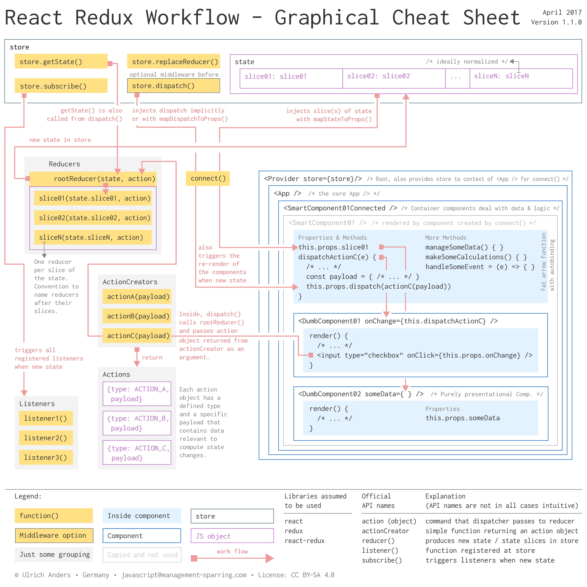

# react-redux-cheatsheet

Version Cheatsheet: 1.1.0 
Version Article: 1.2.0

## Overview

This repository contains a graphical cheat sheet for the workflow and concept of Redux in two resolutions: 1440px and 3840px.

The idea is to help new and existing Redux users to understand how the general mechanism of Redux works in some more detail and where to hook into this process.

## Article

This repo furthermore holds an [article](/article/react-redux-concept-workflow.md) that walks you through an extended version of this cheat sheet. Two very common libraries have been added to the extended version: 'react-router' and 'immutable'.

So, in order to supplement existing tutorials, this article describes the Redux conceptual overview and its workflow in a React Redux app. The description is starting with the dominant player in Redux Applications which is the store. Once the workflow is understood, it might probably be much easier to follow all of the above tutorials.

While going the full circle the article also points to some of the common external libraries and how they would come into play: 'immutable', 'normalizr', 'reselect', 'redux-thunk', 'redux-saga', 'redux-promise' and 'redux-persist'.

Please, raise an issue in case you find errors or things to be not clear enough.

## Notes

Note, that a one page cheat sheet can not always reflect the general case. This holds true in the following cases:

1. The store holds the state of the app. The state of the app is typically sliced in slices. A state that is not sliced is a state with a single slice.
2. An *actionCreator()* can have a more general interface. If you want to adopt action creators with a common interface, read more about *payload* in the [*Flux Standard Action*](https://github.com/acdlite/flux-standard-action).

## Thanks

In case you would like to read detailed comments on this cheat sheet you can go to [Redux issue #2254](https://github.com/reactjs/redux/issues/2254).

Special thanks for improving and correcting this cheat sheet go to:

+ [markerikson](https://github.com/markerikson)

+ [naw](https://github.com/naw)

+ [sompylasar](https://github.com/sompylasar)

