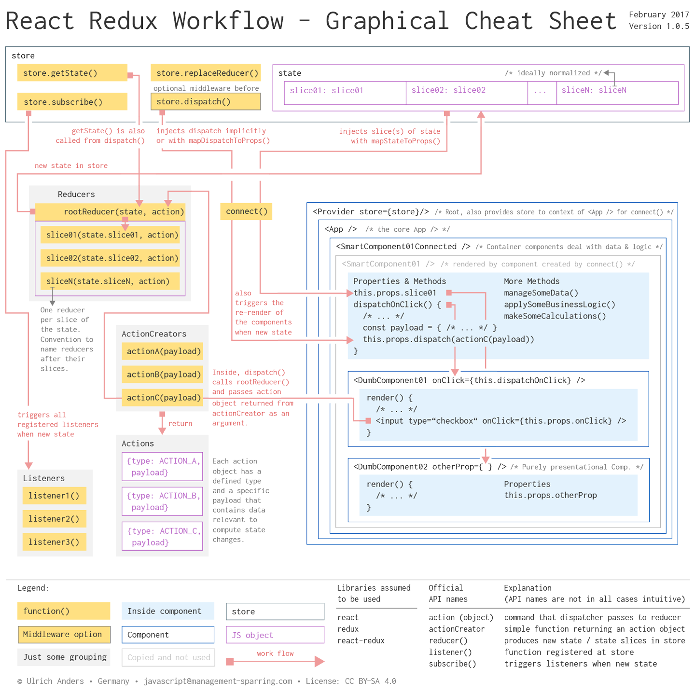

# react-redux-cheatsheet

## Overview

This repository contains a graphical cheat sheet for the workflow and concept of Redux in two resolutions: 1440 and 3840.

The idea is to help new and existing Redux users to understand how the general mechanism of Redux works in a little bit more detail and where to hook into this process.

## Article

This repo furthermore holds an [article](/article/react-redux-concept-workflow_v105.md) that walks you though an extended version of this cheatsheet. Two very common libraries have been added to the extended version: 'react-router' and 'immutable'.

The article runs through the Redux workflow starting at the dominant Redux player: the store.
While going the full circle the article introduces the main Redux concepts and touches briefly on some external libraries such as: 'redux-persist', 'redux-thunk', 'redux-saga', 'redux-promise', 'reselect' and 'normalizr'.

Please, raise an issue in case you find errors or things to be not clear enough.

## Notes

Note, that a one page cheat sheet can not always reflect the general case. This holds true in the following cases:

1. The store holds the state of the app. The state of the app is typically sliced in slices. A state that is not sliced is a state with a single slice.
2. An *actionCreator()* can have a more general interface. If you want to adopt actionCreators with a common interface, read more about *payload* in the [*Flux Standard Action*](https://github.com/acdlite/flux-standard-action).

## Thanks

In case you would like to read detailed comments on this cheat sheet you can go to [Redux issue #2254](https://github.com/reactjs/redux/issues/2254).

Special thanks for improving and correcting this cheat sheet go to:

+ [markerikson](https://github.com/markerikson)

+ [naw](https://github.com/naw)

+ [sompylasar](https://github.com/sompylasar)

